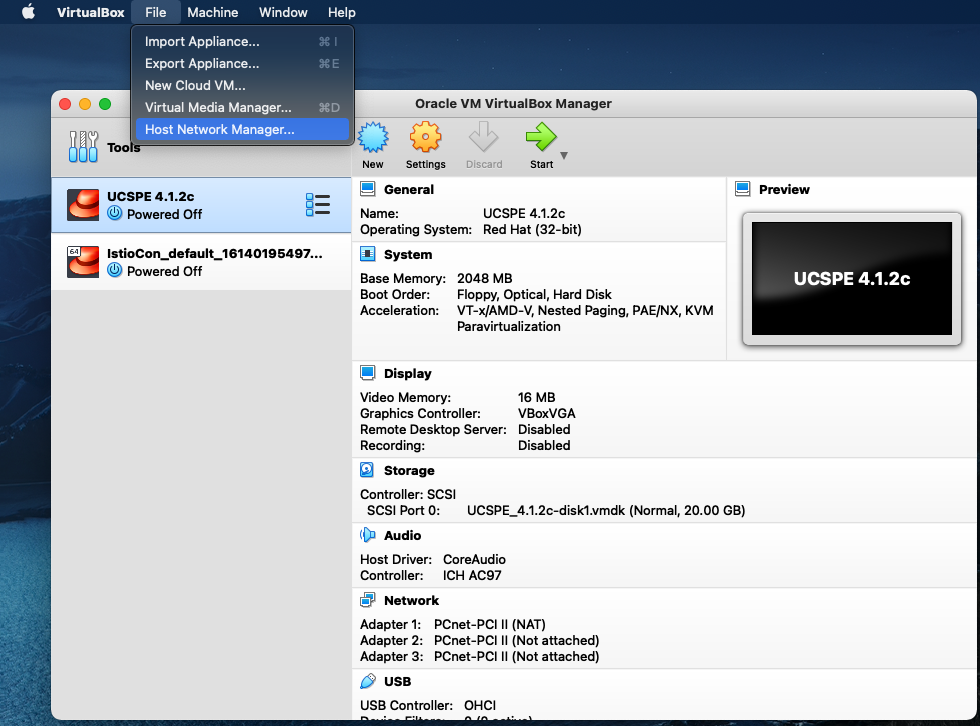
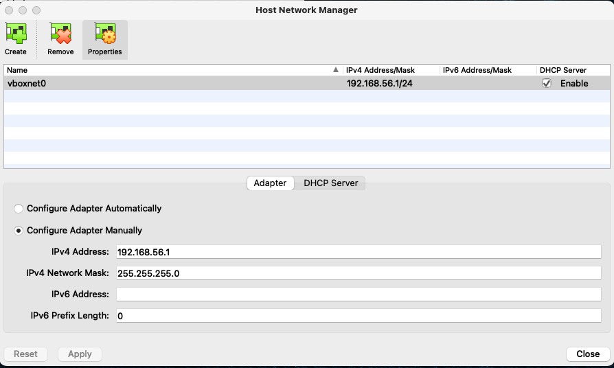

# Kubernetes Cluster Vagrant Files

This repository has Vagrant content, notes, and instructions for building
small, lab ready, Kubernetes clusters on your local laptop.  I have used
these resources for studying for the Certified Kubernetes Administrator
exam.

There are two Vagrantfiles: a [single node control plane](single/Vagrantfile)
and a [multi-node control plane](multi/Vagrantfile)

These files build the virtual machines in VirtualBox on your laptop and
set up the pre-requisites for leveraging kubeadm to install/configure
your cluster.

## Requirements

Tested on a MacBook Pro running Big Sur, with the following software
installed via HomeBrew:

- VirtualBox (tested with 6.1.22)
- Vagrant (tested with 2.2.17)

### VirtualBox Setup

You'll also need to create a dedicated host network on which the VMs will
attach and communicate. The Vagrantfile assumes that you will be using:

- Network Name: vboxnet0
- IP Subnet: 192.168.56.0/24

If you've never done that before in VirtualBox, these two screenshots
will help:





If you have an existing vboxnet0 network or the 192.168.56.0/24 is already
used by another network, you'll have to update the Vagrantfile entries
for each VM to correct the VM network attachment, an example of which is:

```bash
control1.vm.network "private_network", ip: "192.168.56.11", name: "vboxnet0", hostname: true
```

You'll also have to update the IP addresses in the /etc/hosts entry population
found in the Vagrantfile in lines like this:

```bash
echo "192.168.56.10 control.local control" >> /etc/hosts
```

## Caveat for rapidly evolving ecosystems

When I tested for the Certified Kubernetes Administrator exam, I was able
to lock versions at K8s 1.19.x and leverage Docker 19.x. Since the exam and
cleaning up this repository for publication, Ubuntu removed Docker 19.x from
the APT repository - so warnings are generated about the 20.x version not
being validated. The few things I've tested (deployments of NGINX, e.g.)
see to work. YMMV.

In short, don't use this for production. It's a study environment.
